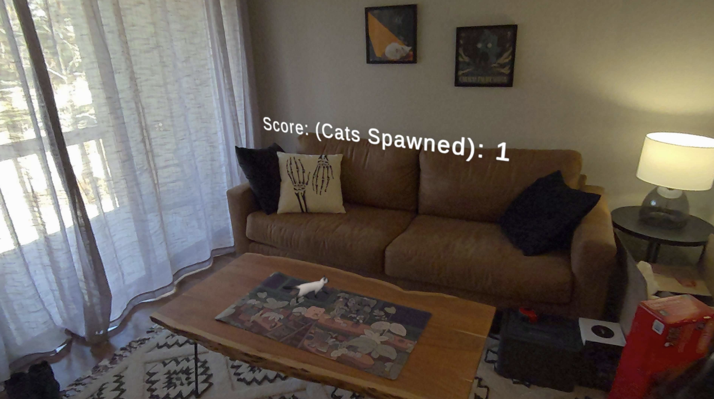

# Project 2: Augmented Reality Game: Herding Cats
### 2025-02-25

---

## Authors:
### Pavan D
### Viviana J
### Sahba S

---

## 1. Introduction

a. Motivation

The goal of this project was to create an augmented reality game that utilizes the Meta Quest 3's capabilities. We wanted to explore the potential of AR in gaming and how it can enhance user experience. The idea of herding cats was chosen as a fun and engaging concept that would allow us to experiment with the technology while having simple interaction and mechanics.

 

b. What Was Built

In our VR game, Herding Cats, cats continuously appear on a table and begin crawling toward the edges. The player's objective is to grab and pull them back to the center to keep them from falling off. The game features a scoring system that tracks how many cats you successfully manage.
The game was built in Unity 5 with C# using the Meta SDK and the Meta Quest 3. We also utililze the Mixed Reality Utility Kit (MRUK) to make calculations about the physical environment.

## 2. Related Work

## 3. Implementation

Our game consisted of a 

Our team was able to ef

A valuable lesson we l

## 4. Future Work

Todo
